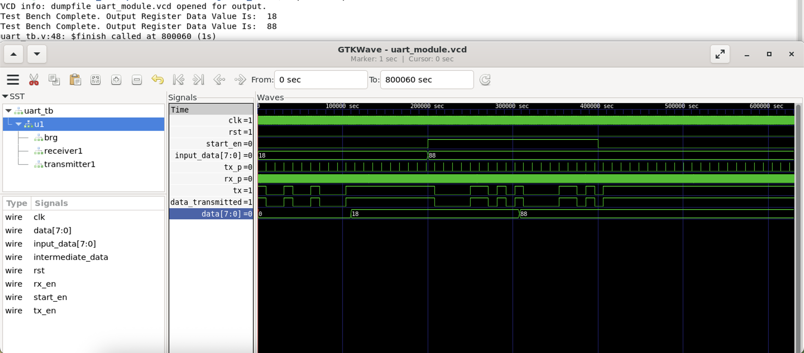

# UNIVERSAL ASYNCHRONOUS RECEIVER TRANSMITTER (UART)

This folder contains the verilog code for UART.

**Modules:**
- Baud Rate Generator module
- Transmitter module
- Receiver module
- Top module
- Test bench

The below image denotes the waveform generated for the UART. Here, the transmitter transmits **"18"** and **"88"** and the same values are received in the receiver

- input_data: Input register
- data: Output register
---
